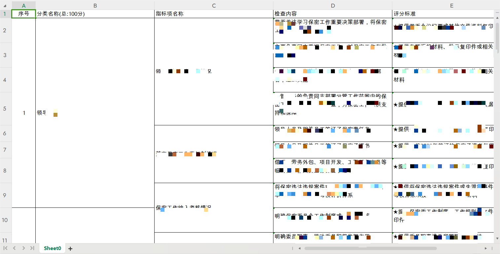
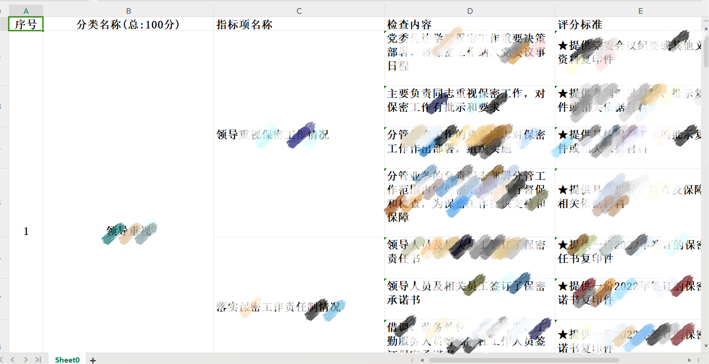
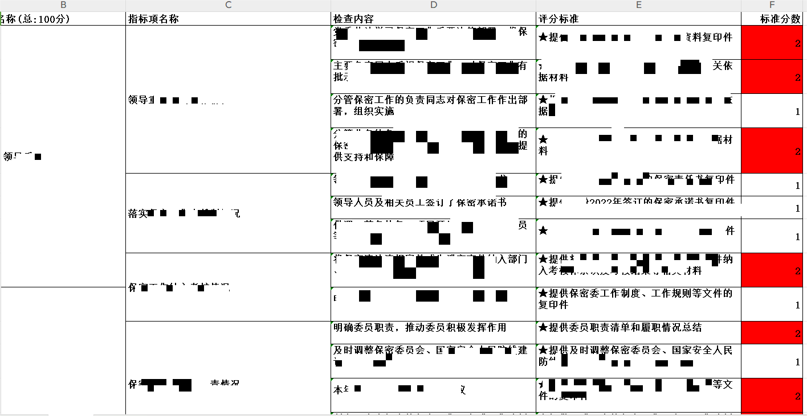
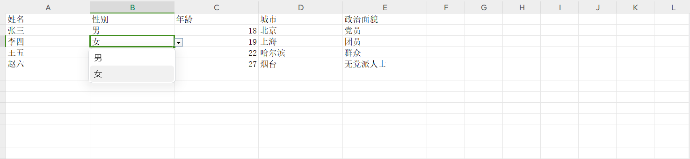
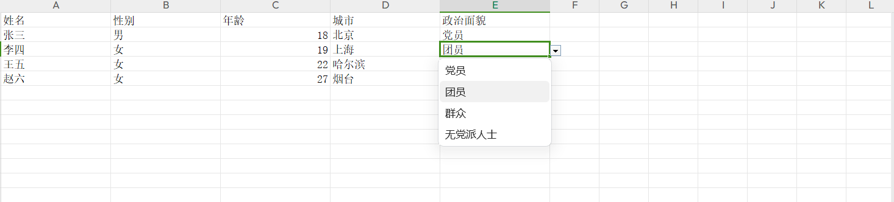

# 项目描述
        该项目对 org.apache.poi模块进行了二次封装，目的是为了简化开发人员对poi的操作，只要按照约定规范，使用对应的注解、按指定数据结构传入数据，即可轻松实现数据的导出工作。
    目前项目主要针对 excel、word等文件进行操作，支持导出字段的局部样式、全局样式、条件样式等。后续会不断扩展。项目当前处于开发测试阶段，可能会存在一些bug，欢迎小伙伴们
    发现问题并留言指出，我们的开发攻城狮，会在第一时间内进行修复。
#### 项目地址
    https://hub.gitlab.com/aidustry/aidustry-boot-poi-starter.git

#### 核心功能
* [excel](#一、Excel模块)
* [word](#二、Word模块)

## 一、Excel模块
  ### 1.注解
  #### 1.1 @ExcelField
    使用范围：在对象属性上使用

    作用：表示该属性需要导出到excel，并生成对应的数据列

    注解参数：

       title<String>: 标题名称

       width<int>: 列宽（宽度=256 * 最大可展示字数，256为展示一个字符所需宽度）

       mergeRow<boolean>: 是否开启行合并；开启后会把excel列中内容相同的单元格进行合并

       align<AlignType>: 列对齐方式，有三种：左对齐、居中对齐、右对齐，默认左对齐

  #### 1.2 @ExcelDropDownBox

    使用范围：在对象属性上使用
    
    作用：给当前导出字段所在列，设置下拉框

    注解参数：
        
        active<boolean>：是否激活，默认否；激活时才会生效

        values<String[]>：下拉框数据项

        valuesMap<String[]>：下拉框数据项值映射（注意：映射数据需要与values参数中的下拉项一一对应）

* 示例

```java
    import lombok.Data;

    @Data
    public class ExportUserVO {

        @ExcelField(title = "姓名")
        private String name;

        @ExcelField(title = "性别")
        @ExcelDropDownBox(values = {"男", "女"})
        private String gender;

        @ExcelField(title = "年龄")
        private Integer age;

        @ExcelField(title = "城市")
        private String city;

        @ExcelField(title = "政治面貌")
        @ExcelDropDownBox(values = {"党员", "团员", "群众", "无党派人士"}, valuesMap = {"1", "2", "3", "4"})
        private Integer political;
    }
```

   

 #### 1.3 @ExcelGlobalStyle

    使用范围：在类上使用

    作用：设置导出excel表格的全局样式，例如：是否展示边框、字体大小、字体名称、是否加粗等

    注解参数：

       showBorder<boolean>：是否展示边框

       fontSize<Short>：字体大小，默认11

       bold<boolean>： 字体是否加粗，默认否

       fontName<String> 字体名称，默认为宋体

       bgColor<IndexedColors>： 背景色

#### 1.4 @ExcelConditionStyle

    使用范围：在对象属性上使用

    作用：根据条件表达式设置导出字段的样式，满足条件时，显示对应样式

    注解参数：

       columnIndex<Integer>：列索引（不需要设置）

       condition<String>：条件表达式（格式：字段名 =、>、<、...... 条件值）

       bgColor<IndexedColors>： 背景色

* 条件表达式说明
##### 格式
    属性名  条件  属性值
###### 条件
    =   >   >=   <   <=   !=   and   or

###### 示例
```java
    class A {
    
        @ExcelConditionStyle("name = '小明'")
        private String name;

        @ExcelConditionStyle("age > 20")
        private int age;
        
        private String city;

        @ExcelField(title = "年龄")
        @ExcelConditionStyle(condition = "age > 20 and city = '烟台'", fontColor = IndexedColors.RED, bgColor = IndexedColors.LIGHT_BLUE)
        private Integer age;

}
    
    /*
    1. name为小明
        condition = "name = '小明' "
    2. age大于20
        condition = "age > 20 "
    3. age大于20，且city为 "烟台"    
    */
```

  ### 2.常量

  #### 2.1 AlignType

     说明：单元格对齐方式枚举
```java
public enum AlignType {
    LEFT("左对齐"),
    CENTER("居中对齐"),
    RIGHT("右对齐");
}
```
### 3.使用步骤
#### 3.1 引入依赖
```xml
        <dependency>
            <groupId>com.fast</groupId>
            <artifactId>com.fast.poi</artifactId>
            <version>0.0.1-SNAPSHOT</version>
        </dependency>
```
#### 3.2 创建导出对象，并添加相应注解
```java
@Data
@ExcelGlobalStyle(showBorder = true, fontSize = 10, bold = false, fontName = "Arial Unicode MS")
public class DbExportVO {

    @ExcelField(title = "序号", mergeRow = true, width = 8*256, align = AlignType.CENTER)
    private Integer index;

    @ExcelField(title = "分类名称(总:100分)", mergeRow = true,width = 40*256)
    private String categoryName;

    @ExcelField(title = "指标项名称", mergeRow = true,width = 40*256)
    private String itemName;

    @ExcelField(title = "检查内容",width = 40*256)
    private String content;

    @ExcelField(title = "评分标准",width = 40*256)
    private String standard;

    @ExcelField(title = "标准分数",width = 12*256, align = AlignType.RIGHT)
    @ExcelConditionStyle(condition = "score = 2", bgColor = IndexedColors.RED)
    private String score;
}
```
#### 3.3 构造导出数据集合
此处读取本地文本数据，模拟数据集合。data.txt存放于resource目录下

```java
    class Test {
    private static List<DbExportVO> getData() {
        InputStream ins = ExcelTest.class.getClassLoader().getResourceAsStream("mock/data.txt");
        BufferedReader br = new BufferedReader(new InputStreamReader(ins));
        StringBuilder sb = new StringBuilder();
        String line = "";
        try {
            while ((line = br.readLine()) != null) {
                sb.append(line);
            }
        } catch (Exception e) {
        }

        List<DbExportVO> list = JSONArray.parseArray(sb.toString(), DbExportVO.class);
        return list;
    }
}
```
#### 3.4 导出

```java
@Controller
class TestController {
    
    @Resource
    priavate IExcelService excelService;

    List<DbExportVO> data = getData();
    Workbook wb = excelService.export(data, DbExportVO.class);
}
```
### 4.效果展示

 有边框、10字号、Arial Unicode MS



无边框、14字号、宋体、加粗、第二列居中对齐



条件表达式，满足标准分数为2的展示红色背景



多条件表达式，满足年龄大于20，且城市为烟台的年龄单元格，为蓝色背景，红色字体


下拉框






## 二、Word模块
### 注解
 1. @LoopBlock 循坏区域注解
    作用域：字段
 2. @SpringEL 开启el表达式
    作用域：类
 
### 类
 1. ListData 列表数据，如果文档中有列表展示的地方，可使用此数据类型
 2. ListStyle 列表样式，设置列表的前缀、缩进


### 使用步骤
   1. 读取word模板
   ``` java
     
   ```
   2. 设置导出数据对象
   3. 调用模板渲染方法，对模板进行渲染
